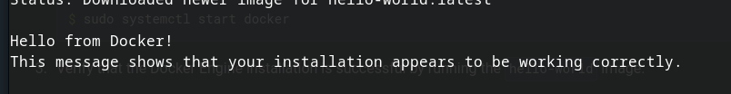
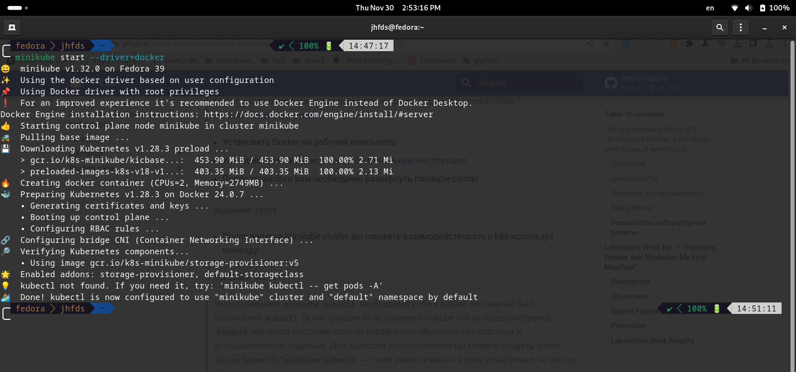

University: [ITMO University](https://itmo.ru/ru/)
Faculty: [FICT](https://fict.itmo.ru)
Course: [Introduction to distributed technologies](https://github.com/itmo-ict-faculty/introduction-to-distributed-technologies)
Year: 2023/2024
Group: K4110c
Author: Sim Maria Lvovna
Lab: Lab1
Date of create: 30.11.2023
Date of finished: 30.11.2023

# Лабораторная работа №1 "Установка Docker и Minikube, мой первый манифест."
## Цель работы
Ознакомиться с инструментами Minikube и Docker, развернуть свой первый "под".
## Ход работы
Установим Docker и Minikube на рабочий компьютер.  
  


`Minikube` - это инструмент, который позволяет создавать локальные кластеры Kubernetes на рабочей станции для разработки, тестирования и отладки приложений перед их развертыванием в более крупных кластерах. `Кластер Kubernetes` позволяет эффективно управлять, масштабировать и обеспечивать отказоустойчивость контейнеризированных приложений. 

`minikube start` - запуск локального кластера Kubernetes с помощью инструмента Minikube.  


Поскольку minikube не запускается, посетим страницу драйверов, чтобы получить помощь в настройке совместимого контейнера или диспетчера виртуальных машин.  
`minikube start --driver=docker` - установим драйвер Docker.  
`minikube config set driver docker` - делаем Docker драйвером по умолчанию.  


`minikube start` - запускаем minikube cluster.
.png)  

После запуска minikube cluster мы можем взаимодействовать с k8s используя команду:
`minikube kubectl`  


Для удобства использования создадим алиас `alias kubectl="minikube kubectl --"`  

Для первого манифеста был выбран образ HashiCorp Vault. Его следует установить. Но поскольку команда `docker pull vault` не работает, напишем `docker pull vault:1.8.3`.


Напишем манифест для развертывания "пода" HashiCorp Vault, который можно найти в файле manifesto.yaml. После чего создадим сервис для доступа к контейнеру, а также прокинем внутрь порт 8200.
`kubectl apply -f manifesto.yaml` - эта команда применяет конфигурацию, определенную в файле manifesto.yaml, к нашему Kubernetes-кластеру. Обычно в таких файлах определяются ресурсы, такие как поды, службы, развертывания и т. д.

`minikube kubectl -- expose pod vault --type=NodePort --port=8200` - эта команда используется для создания службы (Service) с именем "vault" для пода с именем "vault". Эта служба будет доступна снаружи кластера через тип NodePort и проксирует трафик на порт 8200 внутри контейнера.

`minikube kubectl -- port-forward service/vault 8200:8200` - эта команда настраивает прямое соединение (port-forward) между локальным компьютером и службой "vault" в кластере. Таким образом, любые запросы, отправленные на локальный порт 8200, будут перенаправлены на порт 8200 службы "vault" внутри кластера.


В контексте Kubernetes, `кластер` - это набор физических или виртуальных компьютеров, которые работают вместе для выполнения контейнеризированных приложений и сервисов. Кластер Kubernetes состоит из нескольких узлов (nodes), которые выполняют различные роли в системе.

Основные компоненты кластера Kubernetes:
+ Мастер-узел (Master Node): Это узел, который управляет кластером. Он отвечает за принятие решений о том, где должны быть развернуты контейнеры (поды), отслеживает их текущее состояние, управляет распределением нагрузки и обеспечивает общее управление кластером.
+ Рабочие узлы (Worker Nodes): Эти узлы предоставляют вычислительные ресурсы (CPU, память, сеть) и запускают контейнеры. Каждый рабочий узел управляет несколькими подами, что позволяет кластеру эффективно масштабироваться и обрабатывать большое количество контейнеров.
+ Поды (Pods): Под - это наименьшая и базовая единица развертывания в Kubernetes. Под представляет собой один или несколько контейнеров, которые разделяют сетевое пространство, а также объединены в одну безопасную, изолированную единицу.
+ Службы (Services): Службы предоставляют постоянное сетевое точку доступа к одному или нескольким подам, даже если они могут быть переназначены в разные узлы кластера.

После выполнения команд был получен доступ к Vault UI по ссылке http://localhost:8200. После перехода по ней у нас открывается следующий интерфейс:


Токен от Vault находится в логах, найдем его, используя следующую команду:
`minikube kubectl -- logs vault` - команда, используемая для просмотра журналов (логов) контейнера с именем "vault" в локальном кластере Kubernetes, управляемом инструментом Minikube, где:
+ `minikube` - Это инструмент для управления локальными кластерами Kubernetes.
+ `kubectl` - Это официальный клиент командной строки Kubernetes для взаимодействия с кластерами.
+ `-- logs vault` - Эта часть команды указывает, что мы хотим просмотреть логи контейнера с именем "vault" в нашем кластере.  
Таким образом, эта команда извлекает логи из контейнера "vault" в локальном Kubernetes-кластере с помощью Minikube. Логи часто предоставляют информацию о работе контейнера, такую как сообщения о состоянии, ошибки, и другую отладочную информацию, которая может быть полезной при разработке и отладке приложений.

```console                         
Couldn't start vault with IPC_LOCK. Disabling IPC_LOCK, please use --privileged or --cap-add IPC_LOCK
==> Vault server configuration:

             Api Address: http://0.0.0.0:8200
                     Cgo: disabled
         Cluster Address: https://0.0.0.0:8201
              Go Version: go1.16.7
              Listener 1: tcp (addr: "0.0.0.0:8200", cluster address: "0.0.0.0:8201", max_request_duration: "1m30s", max_request_size: "33554432", tls: "disabled")
               Log Level: info
                   Mlock: supported: true, enabled: false
           Recovery Mode: false
                 Storage: inmem
                 Version: Vault v1.8.3
             Version Sha: 73e85c3c21dfd1e835ded0053f08e3bd73a24ad6

==> Vault server started! Log data will stream in below:
...
You may need to set the following environment variable:

    $ export VAULT_ADDR='http://0.0.0.0:8200'

The unseal key and root token are displayed below in case you want to
seal/unseal the Vault or re-authenticate.

Unseal Key: i02CCZ+Vxw4aoeZK2E5A7u4LFBvn3AQOC+ZBj6TNpDE=
Root Token: s.kPSTjmlFBjfGhdhljB21ihiM

Development mode should NOT be used in production installations!

```

Вводим в соответствующее поле Root Token: s.kPSTjmlFBjfGhdhljB21ihiM и переходим по сайту далее.


##Вопросы 
1. Что сейчас произошло и что сделали команды указанные ранее? (Создание "пода" на основе манифеста и образа HashiCorp Vault, создание сервиса и соотнесение портов)
2. Где взять токен для входа в Vault? (minikube kubectl -- logs vault)
Подробные ответы указаны в самом отчете.

##Схема организации контейнеров и сервисов
