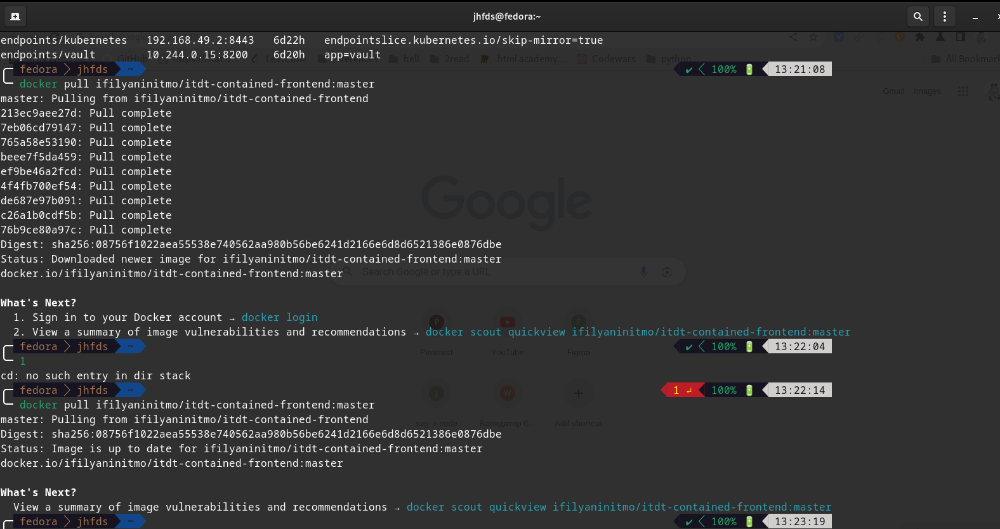
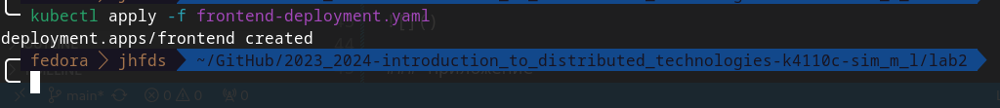
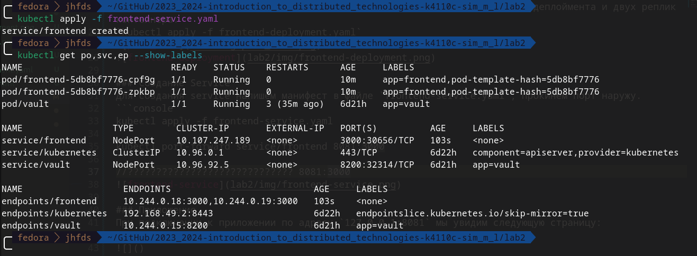
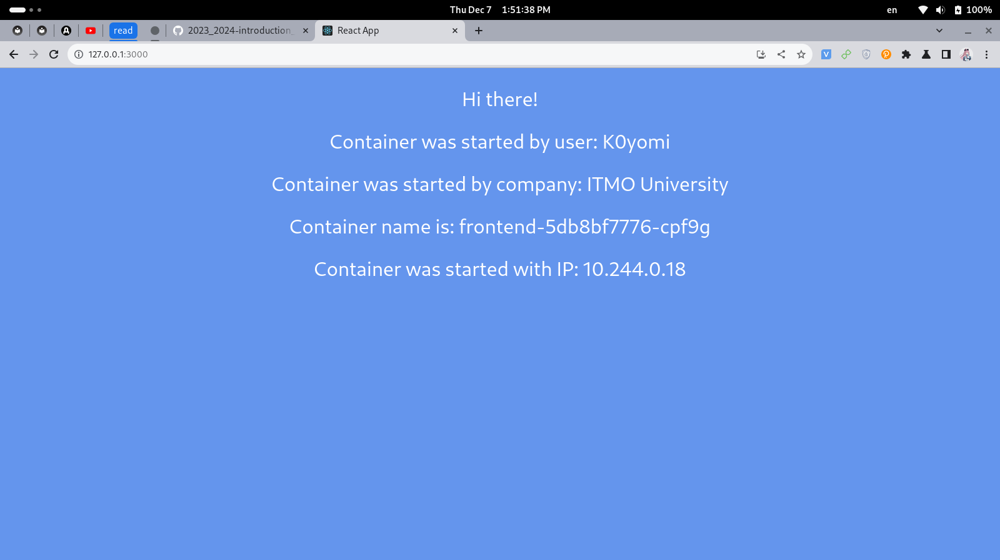
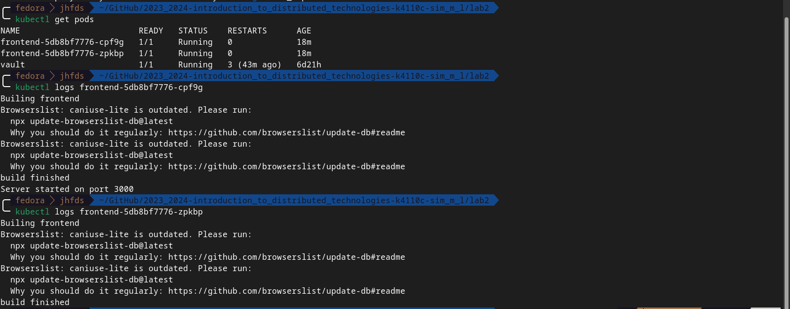
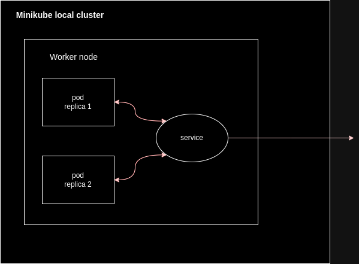

University: [ITMO University](https://itmo.ru/ru/)
Faculty: [FICT](https://fict.itmo.ru)
Course: [Introduction to distributed technologies](https://github.com/itmo-ict-faculty/introduction-to-distributed-technologies)
Year: 2023/2024
Group: K4110c
Author: Sim Maria Lvovna
Lab: Lab2
Date of create: 7.12.2023
Date of finished: 7.12.2023

# Лабораторная работа №2 "Развертывание веб сервиса в Minikube, доступ к веб интерфейсу сервиса. Мониторинг сервиса."
## Цель работы
Ознакомиться с типами "контроллеров" развертывания контейнеров, ознакомится с сетевыми сервисами и развернуть свое веб приложение.
## Задачи
+ Создать Deployment с 2 репликами контейнера  ifilyaninitmo/itdt-contained-frontend:master и передать переменные в эти реплики: REACT_APP_USERNAME, REACT_APP_COMPANY_NAME
+ Создать сервис через который у вас будет доступ на эти "поды".
+ Запустить в minikube режим проброса портов и подключитесь к вашим контейнерам через веб браузер.
+ Проверить на странице в веб браузере переменные REACT_APP_USERNAME, REACT_APP_COMPANY_NAME и Container name. Изменяются ли они? Если да то почему?  

## Ход работы
`minikube start --driver docker` - запустим minikube cluster с драйвером docker

### Создание Deployment
Для создания deployment напишем манифест в файле `frontend-deployment.yaml`.  
В манифесте указываем образ для контейнера, количество реплик - 2, передаем значения для переменных и значение порта контейнера. После создания проверяем наличие деплоймента и двух реплик контейнера.  
`kubectl apply -f frontend-deployment.yaml`
  <br>
 <br>
Содержание файла frontend-deployment.yaml:
```yaml
apiVersion: apps/v1
kind: Deployment
metadata:
  name: frontend
  labels:
    app: frontend
spec:
  replicas: 2
  selector:
    matchLabels:
      app: frontend
  template:
    metadata:
      labels:
        app: frontend
    spec:
      containers:
      - name: frontend
        image: ifilyaninitmo/itdt-contained-frontend:master
        ports:
          - containerPort: 3000
        env:
          - name: REACT_APP_USERNAME
            value: K0yomi
          - name: REACT_APP_COMPANY_NAME
            value: ITMO University
```

### Создание Service
Для создания service напишем манифест в файле `frontend-service.yaml`, прокинем порт наружу.  
```console
kubectl apply -f frontend-service.yaml
kubectl port-forward services/frontend 3000:3000
```
<br>

Содержание файла frontend-service.yaml:
```yaml
apiVersion: v1
kind: Service
metadata:
  name: frontend
spec:
  type: NodePort
  selector:
    app: frontend
  ports:
  - port: 3000
    targetPort: 3000
```

### Приложение
При подключении к приложении по адресу `127.0.0.1:3000` мы увидим следующую страницу:
 <br>

Переменные соответствуют тем, которые были переданы в коде.  
Запущены две реплики, в браузере отображается информация одной из них, поэтому параметры не изменяются при обновлении страницы.  
Получим список подов, запросим логи из них:


## Схема
