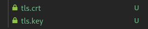
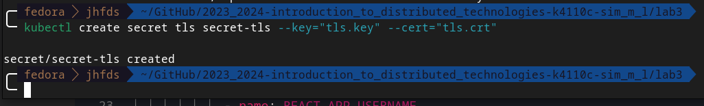
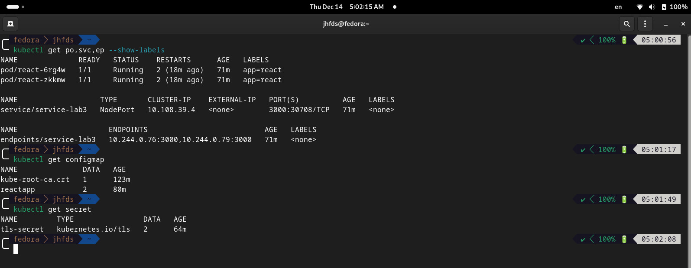
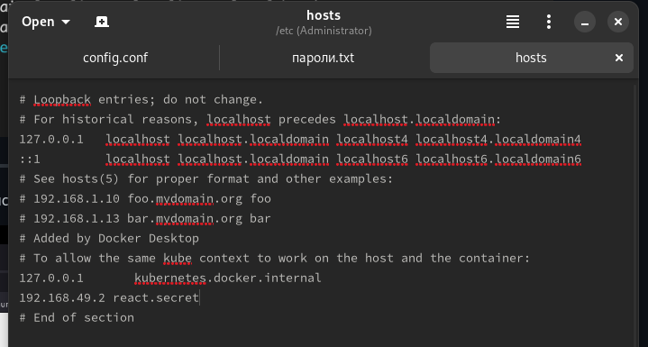
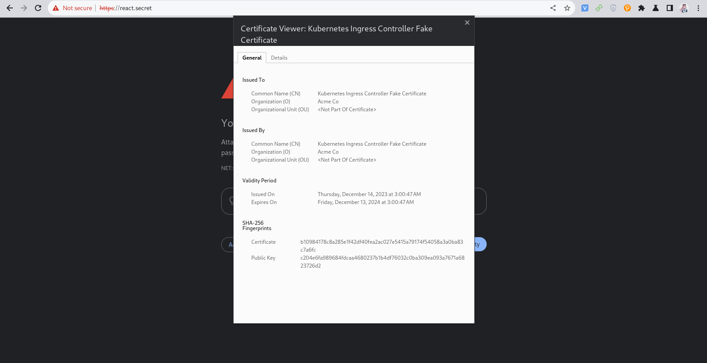
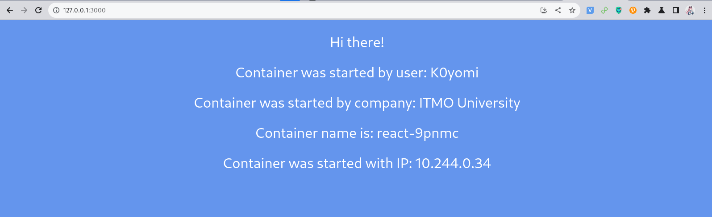

University: [ITMO University](https://itmo.ru/ru/)
Faculty: [FICT](https://fict.itmo.ru)
Course: [Introduction to distributed technologies](https://github.com/itmo-ict-faculty/introduction-to-distributed-technologies)
Year: 2023/2024
Group: K4110c
Author: Sim Maria Lvovna
Lab: Lab3
Date of create: 14.12.2023
Date of finished: 14.12.2023

# Лабораторная работа №3 "Сертификаты и "секреты" в Minikube, безопасное хранение данных."
## Цель работы
Познакомиться с сертификатами и "секретами" в Minikube, правилами безопасного хранения данных в Minikube.

## Ход работы
### Cоздадим configMap с переменными: REACT_APP_USERNAME, REACT_APP_COMPANY_NAME.
`ConfigMap` в контексте Kubernetes - это ресурс, который используется для хранения конфигурационных данных в виде пар ключ-значение. Эти данные могут быть использованы контейнерами внутри подов (Pods), чтобы получить конфигурационные параметры, переменные окружения, файлы конфигурации и т. д. <br>
ConfigMap позволяет абстрагировать конфигурацию от приложения и хранить её централизованно в виде объекта Kubernetes. Это упрощает управление конфигурацией, так как изменения могут быть внесены в ConfigMap без изменения самого контейнера или пода. <br>
Получим файл `config_map.yaml`: <br>
```yaml
apiVersion: v1
kind: ConfigMap
metadata:
  namespace: lab3
  name: reactapp
data: 
  REACT_APP_USERNAME: K0yomi
  REACT_APP_COMPANY_NAME: ITMO University
```
`kubectl apply -f config_map.yaml` <br>
После создания ConfigMap его можно использовать в поде, добавив ссылку на него в спецификацию пода, когда значения из ConfigMap со своими ключами используются в качестве переменных окружения label 1 и label 2 внутри контейнера пода, где label 1 и label 2 - примеры значения ключей.


### Создадим replicaSet с 2 репликами контейнера ifilyaninitmo/itdt-contained-frontend:master и используя ранее созданный configMap передадим переменные REACT_APP_USERNAME, REACT_APP_COMPANY_NAME.
Получаем следующий файл `replica_set.yaml`: <br>
```yaml
apiVersion: v1
kind: Namespace
metadata:
  name: lab3

---

apiVersion: apps/v1
kind: ReplicaSet
metadata:
  name: react
  labels:
    app: react
spec:
  replicas: 2
  selector:
    matchLabels:
      app: react
  template:
    metadata:
      labels:
        app: react
    spec:
      containers:
        - name: react
          image: ifilyaninitmo/itdt-contained-frontend:master
          ports:
            - containerPort: 3000
          env:
            - name: REACT_APP_USERNAME
              valueFrom:
                configMapKeyRef:
                  name: reactapp
                  key: REACT_APP_USERNAME
            - name: REACT_APP_COMPANY_NAME
              valueFrom:
                configMapKeyRef:
                  name: reactapp
                  key: REACT_APP_COMPANY_NAME

---
apiVersion: v1
kind: Service
metadata:
  name: service-lab3
  namespace: lab3
spec:
  selector:
    app: react
  ports:
    - port: 3000
      protocol: TCP
      name: http
  type: NodePort
```

### Включим minikube addons enable ingress и сгенерируем TLS сертификат, импортируем сертификат в minikube.
```console
minikube addons enable ingress
openssl req -x509 -nodes -days 365 -newkey rsa:2048 -keyout tls.key -out tls.crt -subj "/CN=react.secret"
```
`minikube` Это инструмент для локального запуска кластера Kubernetes на нашем компьютере в рамках виртуальной машины. Он упрощает разработку, тестирование и эксперименты с приложениями, использующими Kubernetes. <br>
`addons` Это набор дополнительных компонентов или функций, которые можно включить или выключить в Minikube. В данном случае, аддон Ingress предоставляет механизм маршрутизации внешнего трафика к сервисам в нашем кластере. <br>
`enable` Это ключевое слово, указывающее, что мы хотим включить указанный аддон. <br>
`ingress` Это название аддона, который мы хотим включить. Ingress - это ресурс Kubernetes, который позволяет управлять внешним доступом к службам в кластере. <br> <br>

`req` Это подкоманда OpenSSL, используемая для обработки запросов на сертификаты. <br>
`-x509` Этот флаг указывает, что мы хотим создать самозаверяющий сертификат (self-signed certificate), а не запрос на подпись сертификации (Certificate Signing Request, CSR).<br>
`-nodes` Этот флаг означает, что ключевой файл (private key), который будет создан, не будет зашифрован паролем. Это удобно в сценариях, где не требуется ввод пароля при каждом использовании закрытого ключа.<br>
`-days 365` Этот флаг указывает срок действия сертификата в днях. В данном случае, сертификат будет действителен в течение 365 дней.<br>
`-newkey rsa:2048` Этот флаг указывает на создание нового закрытого ключа RSA с длиной 2048 бит.<br>
`-keyout tls.key` Этот параметр определяет имя файла, в который будет сохранен закрытый ключ (private key).<br>
`-out tls.crt` Этот параметр определяет имя файла, в который будет сохранен самозаверяющий сертификат.<br>
`-subj "/CN=react.secret"` Этот параметр используется для указания подлежащего субъекта (Subject) сертификата. В данном случае, субъект будет содержать Common Name (CN) "react.secret". Common Name обычно используется для указания основного домена, для которого выпускается сертификат.<br>

Таким образом, выполнение этой команды приведет к созданию самозаверяющего сертификата с указанными параметрами, включая закрытый ключ и сам сертификат, которые будут сохранены в файлах tls.key и tls.crt соответственно.<br>
 <br>
 <br>
Проверим всё созданное<br>



### Создадим ingress в minikube, где указан ранее импортированный сертификат, FQDN по которому мы будем заходить и имя сервиса который мы создали ранее.
```yaml
apiVersion: networking.k8s.io/v1
kind: Ingress
metadata:
  name: ingress-name
spec:
  tls:
  - hosts:
    - react.secret
    secretName: secret-tls
  rules:
  - host: react.secret
    http:
      paths:
      - path: /
        pathType: Prefix
        backend:
          service:
            name: react
            port:
              number: 3000
```

### В hosts пропишем FQDN и IP адрес нашего ingress и попробуем перейти в браузере по FQDN имени.
 <br>

### Войдем в веб приложение по нашему FQDN используя HTTPS и проверим наличие сертификата.
> Обычно в браузере это маленький замочек рядом с FQDN сайта, нажмите на него и сделайте скриншот с информацией.
 <br>
 <br>

## Схема организации контейеров и сервисов