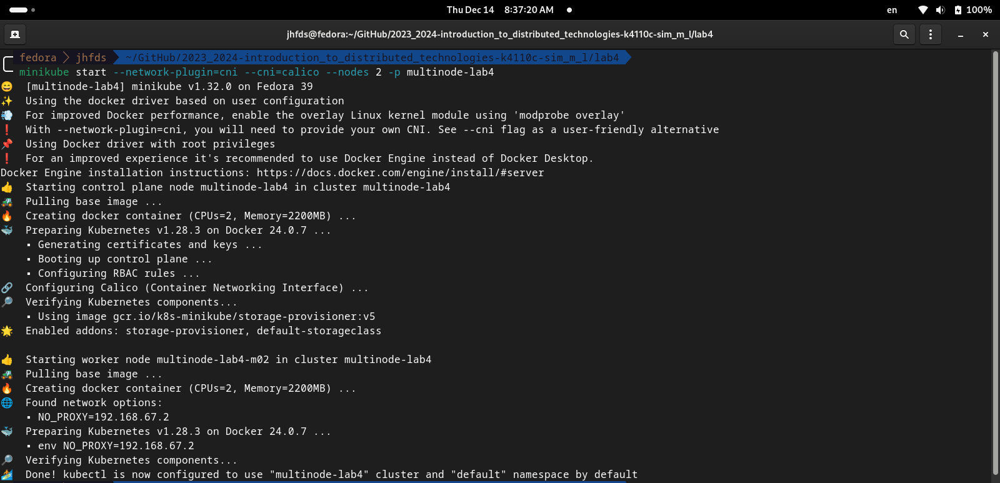
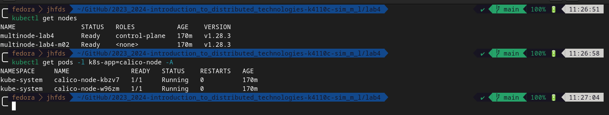
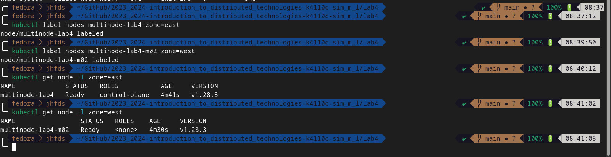
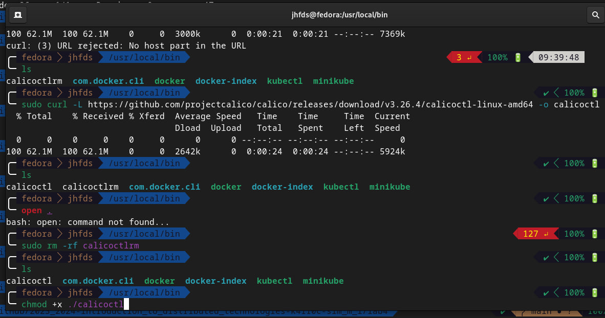
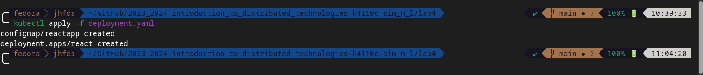
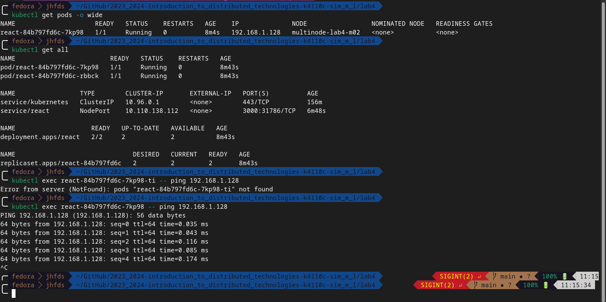

University: [ITMO University](https://itmo.ru/ru/)
Faculty: [FICT](https://fict.itmo.ru)
Course: [Introduction to distributed technologies](https://github.com/itmo-ict-faculty/introduction-to-distributed-technologies)
Year: 2023/2024
Group: K4110c
Author: Sim Maria Lvovna
Lab: Lab4
Date of create: 14.12.2023
Date of finished: 14.12.2023

# Лабораторная работа №4 "Сети связи в Minikube, CNI и CoreDNS"
## Описание
Это последняя лабораторная работа в которой мы познакомимся с сетями связи в Minikube. Особенность Kubernetes заключается в том, что у него одновременно работают `underlay` и `overlay` сети, а управление может быть организованно различными CNI.
## Цель работы
Познакомиться с CNI Calico и функцией `IPAM Plugin`, изучить особенности работы CNI и CoreDNS.

## Ход работы
+ При запуске minikube установим плагин CNI=calico и режим работы Multi-Node Clusters одновеременно, в рамках данной лабораторной работы развернем 2 ноды.
`minikube start --network-plugin=cni --cni=calico --nodes 2 -p multinode-demo` <br>
 <br>

+ Проверим работу CNI плагина Calico и количество нод.
```console
kubectl get nodes
kubectl get pods -l k8s-app=calico-node -A
```
 <br>

+ Для проверки работы Calico мы попробуем одну из функций под названием IPAM Plugin. Для проверки режима IPAM необходимо для запущеных ранее нод указать label по признаку стойки или географического расположения (на наш выбор).
 <br>
```console
kubectl label nodes multinode-demo direction=north  
kubectl label nodes multinode-demo-m02 direction=south
kubectl get nodes -L direction --show-labels
```

+ После этого разработаем манифест для Calico который бы на основе ранее указанных меток назначал бы IP адреса "подам" исходя из пулов IP адресов которые мы указали в манифесте.
Установим `calicoctl`. <br>
 <br>

```yaml
apiVersion: projectcalico.org/v3
kind: IPPool
metadata:
  name: east-ippool
spec:
  cidr: 192.168.0.0/24
  ipipMode: Always
  natOutgoing: true
  nodeSelector: zone == "east"
---
apiVersion: projectcalico.org/v3
kind: IPPool
metadata:
  name: west-ippool
spec:
  cidr: 192.168.1.0/24
  ipipMode: Always
  natOutgoing: true
  nodeSelector: zone == "west"
```
Удалим имеющийся IPPool и создадим новые на основе манифеста.<br>

```console
kubectl calico delete ippools default-ipv4-ippool --allow-version-mismatch
kubectl calico create -f calico.yml --allow-version-mismatch
kubectl calico get ippool --allow-version-mismatch
```
 <br>

`kubectl apply -f manifesto.yaml` <br>

+  Создадим deployment с 2 репликами контейнера ifilyaninitmo/itdt-contained-frontend:master и передадим переменные в эти реплики: REACT_APP_USERNAME, REACT_APP_COMPANY_NAME. 
```yaml
apiVersion: v1
kind: ConfigMap
metadata:
  name: reactapp
data:
  REACT_APP_USERNAME: K0yomi
  REACT_APP_COMPANY_NAME: ITMO University
---
apiVersion: apps/v1
kind: Deployment
metadata:
  name: react
  labels:
    app: react
spec:
  replicas: 2
  selector:
    matchLabels:
      app: react
  template:
    metadata:
      labels:
        app: react
    spec:
      containers:
        - name: react
          image: ifilyaninitmo/itdt-contained-frontend:master
          ports:
            - containerPort: 3000
          env:
            - name: REACT_APP_USERNAME
              valueFrom:
                configMapKeyRef:
                  name: reactapp
                  key: REACT_APP_USERNAME
            - name: REACT_APP_COMPANY_NAME
              valueFrom:
                configMapKeyRef:
                  name: reactapp
                  key: REACT_APP_COMPANY_NAME
```
`kubectl apply -f deployment.yaml` <br>
 <br>


+ Создадим сервис через который у нас будет доступ на эти "поды". Выбор типа сервиса остается на наше усмотрение. <br>
`kubectl expose deployment react --type=NodePort --port=3000` <br>


+ Запустить в minikube режим проброса портов и подключитесь к вашим контейнерам через веб браузер. <br>
`kubectl po	rt-forward services/react 3000:3000` <br>
 <br>

+ Проверьте на странице в веб браузере переменные Container name и Container IP. Изменяются ли они? Если да то почему? <br>
Переменные Container name и Container IP изменяются в зависисмости от того, на какой под попал запрос. <br>
+ Используя kubectl exec зайдите в любой "под" и попробуйте попинговать "поды" используя FQDN имя соседенего "пода", результаты пингов необходимо приложить к отчету. <br>
 <br>


+ Схема организации контейеров и сервисов <br>